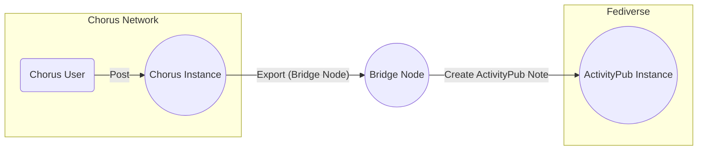
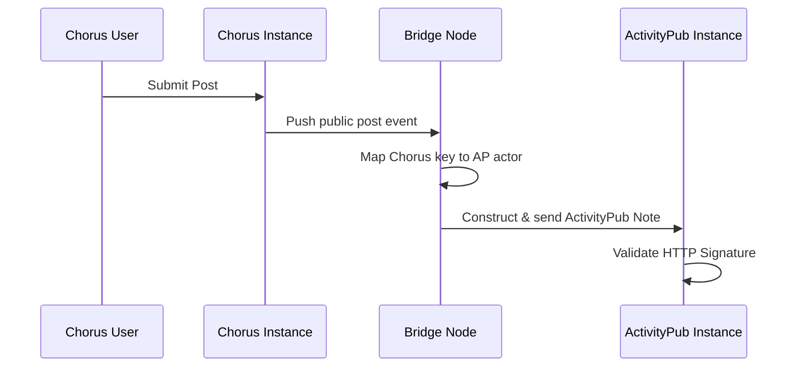
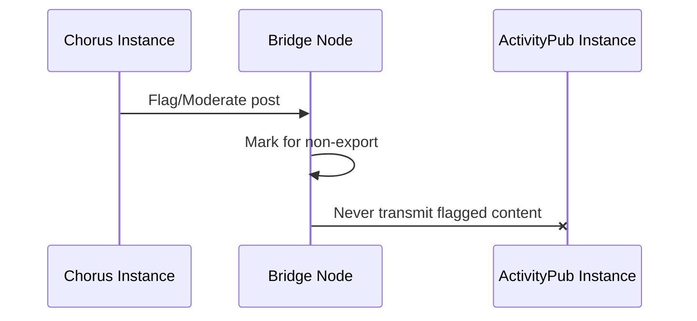
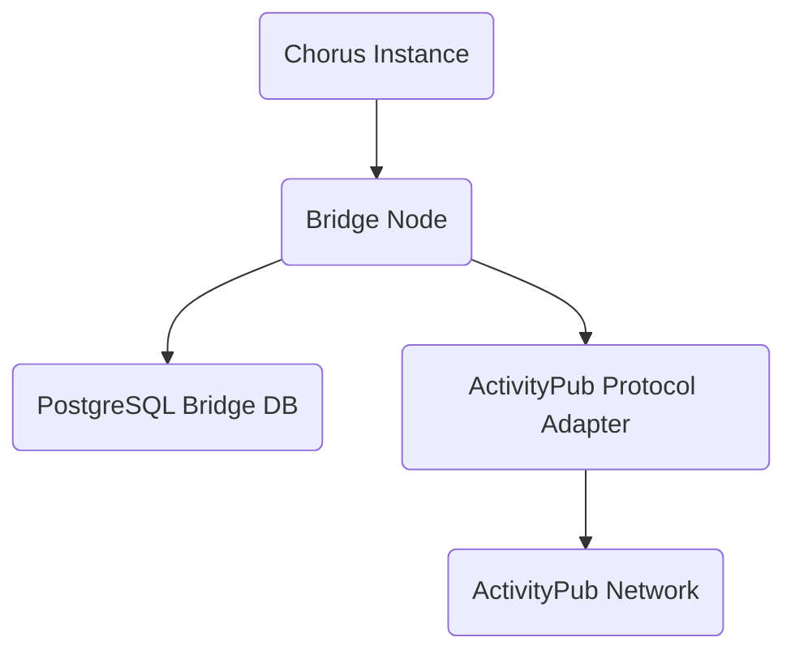

# CFP-009: One-Way ActivityPub Bridge Integration for Chorus

**Version:** 1.1.1
**Status:** Concept Draft
**Date:** October 23, 2025
**Authors:** Chorus Federation Protocol Team & User Contributor

---

## Abstract
This specification outlines a one-way bridge architecture enabling export of anonymized Chorus content (posts, communities) to ActivityPub-compatible Fediverse platforms. This design preserves Chorus’s strict anonymity and timestamp-free guarantees, using a pseudonymous identity mapping strategy. The bridge eschews inbound ActivityPub federation, preventing external metadata contamination and complexity.

---

## 1. Motivation
Chorus’s decentralized, privacy-first philosophy is fundamentally at odds with the persistent identity and timestamp-driven model of ActivityPub. However, exposing anonymized Chorus content to the larger Fediverse provides substantial ecosystem and discoverability benefits while leveraging bridge-layer pseudonymity to protect users.

---

## 2. High-Level Architecture



- **Chorus User** posts within a native instance.
- **Bridge Node** listens for public content/events, maps Chorus keys to AP actors, and constructs ActivityPub activities.
- **ActivityPub Instance** receives a Note, attributed to pseudonymous AP actor, originating from Chorus (without inbound feedback).

---

## 3. Identity Mapping and Privacy Model
- Chorus accounts: transient public keys.
- AP actors: generated URIs linked to Chorus public key hash (never actual username, timestamp, or readable key).
- Exported posts use random offsetting for timestamp approximation, preventing strict time correlation.
- No inbound AP actor mapping; Chorus avoids federating ActivityPub objects inward.

**Example Identity Mapping:**
```python
chorus_pubkey = "abc123..."
bridge_actor_uri = f"https://bridge.chorus.social/actors/{hashlib.sha256(chorus_pubkey.encode()).hexdigest()[:16]}"
```

---

## 4. Content Translation Layer
### 4.1 Chorus → ActivityPub
- All exported Chorus posts and community events are mapped to ActivityStreams objects:
  - `Note` for general posts
  - `Group`/`Create` for community creation
  - `Like` for sentiment votes (positive)
  - **No export** for direct messages or harmful votes

**Example Conversion:**
```python
import datetime
import random
from chorus_object import ChorusPost

def chorus_to_activitypub(chorus_post: ChorusPost, genesis_timestamp):
    day_offset = chorus_post.day_number * 86400
    random_offset = random.randint(0, 86400)
    timestamp = genesis_timestamp + day_offset + random_offset
    published = datetime.datetime.utcfromtimestamp(timestamp).isoformat()
    return {
      "@context": "https://www.w3.org/ns/activitystreams",
      "type": "Note",
      "attributedTo": chorus_post.bridge_actor_uri,
      "content": chorus_post.body_md,
      "published": published,
      "to": ["https://www.w3.org/ns/activitystreams#Public"]
    }
```

### 4.2 Moderation Policy
- Bridge nodes check local moderation state before export.
- Flagged/removed Chorus objects are blocked from translation.

---

## 5. Technical Flow Diagrams

### 5.1 Posting


### 5.2 Moderation


---

## 6. Deployment Structure



- **Bridge Node**: Docker container running FastAPI/Chorus stripped instance + python-federation ActivityPub adapter
- **Bridge DB**: Stores key/actor mappings, non-export lists
- **AP Adapter**: Handles ActivityPub HTTP Sig, WebFinger, Servlet endpoints

---

## 7. Detailed API & Translation Contracts

### Chorus Export Endpoint
```http
POST /api/bridge/export
{ "chorus_post": { ... }, "signature": "..." }
```
- Verifies sig, applies privacy filters, pushes to ActivityPub handler.

### ActivityPub Outbox Example
```json
{
  "@context": "https://www.w3.org/ns/activitystreams",
  "type": "Note",
  "attributedTo": "https://bridge.chorus.social/actors/9a4e8f...",
  "content": "An example Chorus post exported to AP.",
  "published": "2025-10-23T12:00:00Z",
  "to": ["https://www.w3.org/ns/activitystreams#Public"]
}
```

---

## 8. Security Model and Limitations
- **Pseudonymity boundary:** ActivityPub actors are unique per Chorus pubkey, never reused.
- **No inbound injection:** Disables federated remote AP delivery or object import into Chorus.
- **Timestamps approximation:** Randomized day-to-epoch mapping reduces privacy risks.
- **Moderation compliance:** Only non-flagged content exported.

---

## 9. Implementation Example (Docker Compose)
```yaml
version: "3.8"
services:
  bridge:
    build: ./bridge
    ports:
      - "443:443"
    environment:
      - CHORUS_GENESIS_TIMESTAMP=1729670400
      - BRIDGE_DOMAIN=bridge.chorus.social
      - DATABASE_URL=postgresql://bridge:password@db:5432/bridge
    depends_on:
      - db
    volumes:
      - ./keys:/app/keys
      - ./bridge.yaml:/app/bridge.yaml
  db:
    image: postgres:16
    environment:
      - POSTGRES_DB=bridge
      - POSTGRES_USER=bridge
      - POSTGRES_PASSWORD=password
    volumes:
      - bridge_db:/var/lib/postgresql/data
volumes:
  bridge_db:
```

---

## 10. Future Enhancements
- **Selective export controls** for users
- **Federated moderation tokens**
- **Zero-knowledge timestamp proofs**
- **Batch processing/Aggregation** of export events

---

## 11. References
- ActivityPub W3C Recommendation
- Chorus Federation Protocol, context.md
- User bridge proposal (activitypubproposal.md)
- Python Federation Library Docs

---

**Document Status:** Concept Draft v1.1.1
**Contact:** chorus-federation@example.com
