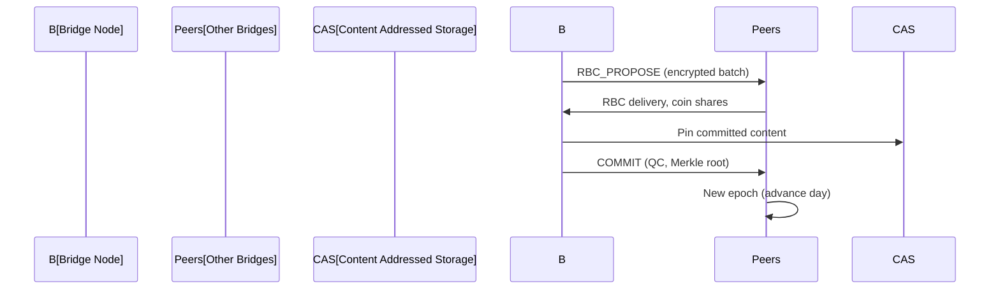

# CFP-010: Conductor — Asynchronous & Time-Agnostic BFT Consensus Network for Chorus Bridge

**Version:** 1.0.0
**Status:** Draft
**Date:** October 23, 2025
**Authors:** Chorus Federation Protocol Team

---

## Abstract
Conductor is a leaderless, asynchronous Byzantine Fault Tolerant (BFT) consensus protocol custom-designed for the Chorus Bridge superhighway. It provides secure, anonymous, and time-agnostic ordering and commitment of federation events, using privacy-preserving batching, threshold cryptography, and day-number epochs. Conductor achieves high scalability and reliability in WAN environments, avoiding patents and strict timing dependencies.

---

## 1. Motivation & Design Principles

- **Asynchrony:** No synchrony assumptions—network can be slow or partitioned, liveness achieved via randomization and threshold cryptography.
- **Time-Agnostic:** Batches and consensus epochs keyed to Chorus day numbers, not wall-clock time; aligns with VDF day proofs.
- **Leaderless:** No designated leader; reduces DoS and censorship risk.
- **Privacy:** Fully content-addressed; payloads travel as encrypted shares and are only revealed upon consensus.
- **Consensus Security:** Tolerates f malicious Bridges out of n ≥ 3f+1.
- **Extensibility:** Designed for Chorus Bridge but modular for future protocol expansion.

---

## 2. Actors & Network Topology
- **Validators:** Chorus Bridge nodes; authorized via allowlist and cryptographic identity (Ed25519).
- **Membership:** Rotates based on governance, recorded as signed events in consensus blocks.
- **Communication:** Gossip over libp2p or gRPC; mutual TLS and node key authentication.

---

## 3. Consensus Mechanism
- **Epochs:** Integer epochs keyed to Chorus day numbers: `epoch = creation_day`.
- **Proposals:** Each Bridge gathers local events (public posts, moderation actions, proofs, etc.) and encrypts its batch under a threshold encryption key.
- **Reliable Broadcast (RBC):** Batches are broadcast as erasure-coded fragments; peers reconstruct proposals without trusting a leader.
- **Threshold Encryption:** Ensures no peer learns any batch until all are delivered.
- **Common Coin:** Used for liveness; random value derived from threshold signature or external randomness (drand).
- **Deterministic Ordering:** Batches ordered by proposer ID and content hash for reproducibility.
- **Commit:** Epoch block finalized with quorum certificate (QC); blocks include Merkle root and payload hashes.

---

## 4. Message Types
- RBC_PROPOSE(epoch, proposer_id, payload_hash, enc_chunks[], k, n)
- ENC_SHARE(epoch, enc_payload_share, proposer_id)
- COIN_SHARE(epoch, coin_sig_share)
- COMMIT(epoch, block_digest, quorum_cert)
- MEMBERSHIP_CHANGE(epoch, update, quorum_cert)

---

## 5. Event Data Model
- PostAnnounce(content_cid, author_pubkey_hash, community_id, creation_day, sig)
- ModerationEvent(target_ref, action, reason_hash, creation_day, sig)
- DayProof(canonical_proof_hash, day_number, validator_quorum_sig)
- MembershipChange(add/remove, validator_pubkey, effective_day, quorum_sig)
- APExportNotice(object_ref, policy_hash, creation_day)

---

## 6. Flow Sequence

---

## 7. Cryptography
- **Signatures:** Ed25519 for node identity/events.
- **Threshold Encryption:** BLS or hybrid KEM; FROST for threshold signing.
- **Common Coin:** Threshold BLS or drand randomness.
- **Content Addressing:** IPFS-compatible CID hashes for payload de-duplication.

---

## 8. Network API
- gRPC or libp2p wire protocol:
  - Submit event batch
  - Deliver RBC fragments and shares
  - Exchange coin shares
  - Commit block / QC

---

## 9. Integration Points
- **Stage ↔ Bridge:** REST/gRPC API for event submit and commit notifications.
- **Bridge ↔ Bridge:** Gossip, consensus messaging.
- **Bridge ↔ AP Exporter:** Publish non-sensitive, committed events to ActivityPub via policy filter.

---

## 10. Governance and Upgrades
- Membership changes via signed events, committed in blocks.
- Consensus algorithm upgrades allowed via RFCs and block-recorded votes.
- Audit log keeps full block history and Merkle proofs.

---

## 11. Storage & Auditing
- On-disk ledger (epochs, blocks, QCs, memberships).
- Pinset management for referenced content hashes.
- State pruning and checkpointing for long-term safety.

---

## 12. Implementation Plan
- Phase 1: Prototype local batching, leaderless RBC, deterministic ordering.
- Phase 2: Integrate threshold encryption and common coin for WAN safety.
- Phase 3: Membership event handling and ActivityPub export callback.
- Phase 4: Monitoring, metrics (Prometheus), security/attack response.

---

## 13. Licensing and Compliance
- Licensed under Apache-2.0, patent-unencumbered. All contributions must sign CLA.

---

## 14. Future Directions
- Adaptive validator sets, differential privacy options for ActivityPub export, advanced membership and UI tools for validator operation.

---

**Document Status:** Draft v1.0.0
**Contact:** chorus-federation@example.com
