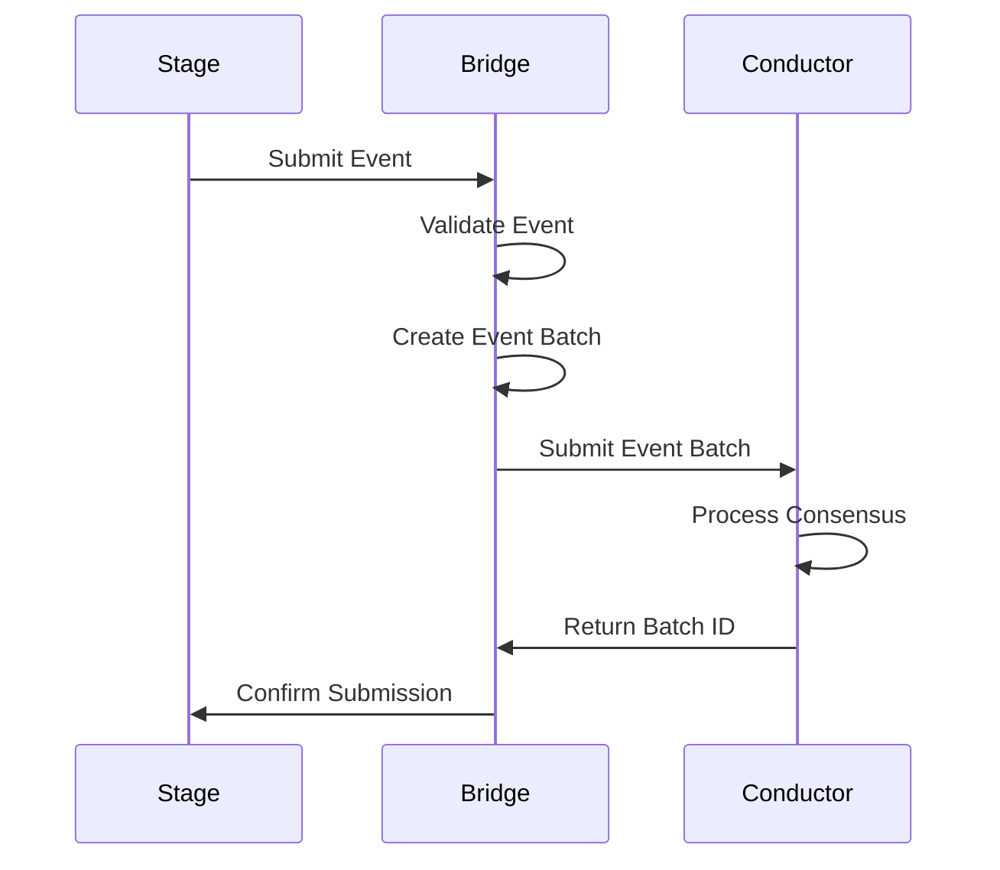
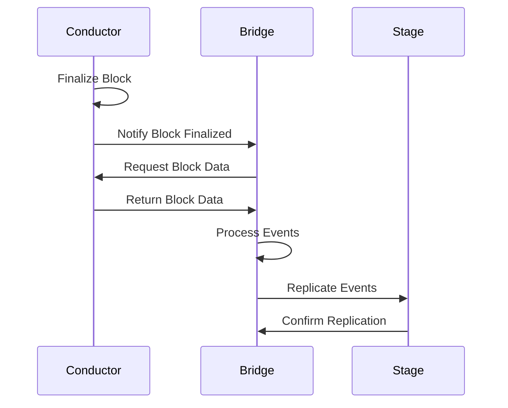
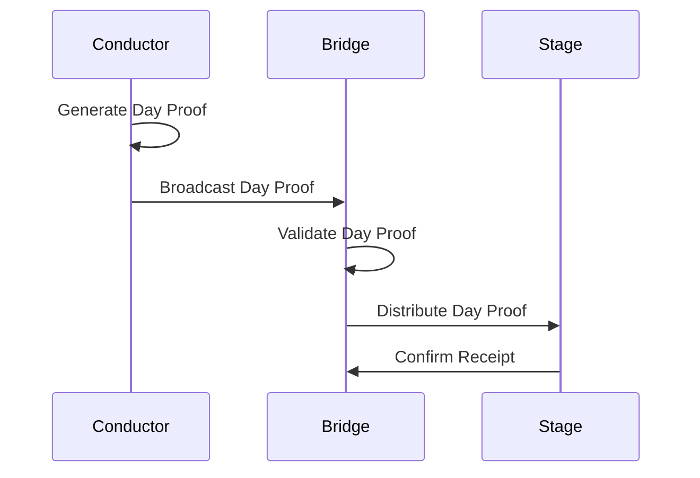

# Chorus Bridge ↔ Conductor Integration Guide

This guide provides comprehensive instructions for integrating Chorus Bridge with the production-ready Conductor consensus engine. This documentation is designed for AI agents and developers to successfully connect and operate the two systems together.

## 🏗️ Architecture Overview

### System Components
- **Chorus Bridge**: Federation and replication layer that manages Stage instances
- **Conductor**: BFT consensus engine with VDF-proven day counters
- **Integration Point**: gRPC APIs for event submission and block finalization

### Data Flow
```
Stage Instances → Bridge → Conductor (Consensus) → Bridge → Stage Instances
```

## 🚀 Quick Start Integration

### 1. Prerequisites

Ensure you have the following running:
- **Conductor**: Production-ready consensus engine
- **Bridge**: Federation layer (to be implemented)
- **Network**: P2P connectivity between components

### 2. Conductor Setup

#### Start Conductor Validators
```bash
# Clone and setup Conductor
git clone https://github.com/Chorus-Social/conductor.git
cd conductor

# Install dependencies
poetry install

# Generate validator keypairs
python generate_keys.py

# Start Conductor cluster
docker-compose up -d
```

#### Verify Conductor Health
```bash
# Check Conductor health
curl http://localhost:8080/health

# Check metrics
curl http://localhost:8080/metrics

# Verify day proof generation
curl http://localhost:8080/day-proof/1
```

### 3. Bridge Integration Points

#### gRPC Service Endpoints
The Conductor exposes the following gRPC services for Bridge integration:

```protobuf
service ConductorService {
  rpc SubmitEventBatch(EventBatchRequest) returns (EventBatchResponse);
  rpc GetBlock(GetBlockRequest) returns (GetBlockResponse);
  rpc GetDayProof(GetDayProofRequest) returns (GetDayProofResponse);
}
```

#### REST API Endpoints
For health checks and monitoring:

```bash
GET /health                    # Health check
GET /day-proof/{day_number}    # Get VDF proof for specific day
GET /metrics                   # Prometheus metrics
```

## 🔧 Bridge Implementation Requirements

### 1. gRPC Client Setup

#### Python Implementation
```python
import grpc
from src.conductor.conductor_pb2_grpc import ConductorServiceStub
from src.conductor.conductor_pb2 import (
    EventBatchRequest, EventBatchResponse,
    GetBlockRequest, GetBlockResponse,
    GetDayProofRequest, GetDayProofResponse
)

class BridgeConductorClient:
    def __init__(self, conductor_endpoint: str):
        self.channel = grpc.insecure_channel(conductor_endpoint)
        self.stub = ConductorServiceStub(self.channel)
    
    async def submit_event_batch(self, events: List[Event]) -> EventBatchResponse:
        request = EventBatchRequest(
            events=[self._serialize_event(event) for event in events],
            batch_id=str(uuid.uuid4()),
            timestamp=int(time.time())
        )
        return await self.stub.SubmitEventBatch(request)
    
    async def get_block(self, block_hash: str) -> GetBlockResponse:
        request = GetBlockRequest(block_hash=block_hash)
        return await self.stub.GetBlock(request)
    
    async def get_day_proof(self, day_number: int) -> GetDayProofResponse:
        request = GetDayProofRequest(day_number=day_number)
        return await self.stub.GetDayProof(request)
```

### 2. Event Serialization

#### Event Structure
```python
class Event:
    def __init__(self, content_cid: str, event_type: str, data: dict):
        self.content_cid = content_cid
        self.event_type = event_type
        self.data = data
        self.timestamp = int(time.time())
        self.signature = None  # Will be set by Bridge
```

#### Serialization for Conductor
```python
def serialize_event_for_conductor(event: Event) -> dict:
    return {
        "content_cid": event.content_cid,
        "event_type": event.event_type,
        "data": event.data,
        "timestamp": event.timestamp,
        "signature": event.signature
    }
```

### 3. Consensus Integration

#### Event Batch Submission
```python
async def submit_events_to_conductor(self, events: List[Event]):
    """Submit events to Conductor for consensus"""
    try:
        # Prepare batch
        batch_request = EventBatchRequest(
            events=[serialize_event_for_conductor(event) for event in events],
            batch_id=str(uuid.uuid4()),
            timestamp=int(time.time())
        )
        
        # Submit to Conductor
        response = await self.conductor_client.submit_event_batch(batch_request)
        
        if response.success:
            logger.info(f"Successfully submitted batch {response.batch_id}")
            return response.batch_id
        else:
            logger.error(f"Failed to submit batch: {response.error_message}")
            raise Exception(f"Conductor submission failed: {response.error_message}")
            
    except grpc.RpcError as e:
        logger.error(f"gRPC error submitting to Conductor: {e}")
        raise
```

#### Block Finalization Handling
```python
async def handle_block_finalization(self, block_hash: str):
    """Handle block finalization from Conductor"""
    try:
        # Get finalized block from Conductor
        block_response = await self.conductor_client.get_block(block_hash)
        
        if block_response.success:
            # Process finalized events
            for event in block_response.events:
                await self._replicate_event_to_stages(event)
            
            logger.info(f"Successfully processed block {block_hash}")
        else:
            logger.error(f"Failed to get block {block_hash}: {block_response.error_message}")
            
    except Exception as e:
        logger.error(f"Error handling block finalization: {e}")
        raise
```

## 📡 Network Configuration

### 1. Conductor Network Setup

#### Bootstrap Configuration
```yaml
# validator.yaml
validator:
  network:
    bootstrap_peers:
      - "/ip4/127.0.0.1/tcp/4001/p2p/12D3KooW..."
      - "/ip4/127.0.0.1/tcp/4002/p2p/12D3KooW..."
    listen_addresses:
      - "/ip4/0.0.0.0/tcp/4001"
    external_address: "/ip4/127.0.0.1/tcp/4001"
```

#### gRPC Service Configuration
```yaml
api:
  grpc:
    host: "0.0.0.0"
    port: 50051
  rest:
    host: "0.0.0.0"
    port: 8080
```

### 2. Bridge Network Configuration

#### Conductor Connection
```python
# Bridge configuration
CONDUCTOR_ENDPOINTS = [
    "localhost:50051",  # Primary Conductor
    "localhost:50052",  # Secondary Conductor
    "localhost:50053",  # Tertiary Conductor
]

# Load balancing and failover
class ConductorConnectionManager:
    def __init__(self, endpoints: List[str]):
        self.endpoints = endpoints
        self.current_endpoint = 0
        self.connections = {}
    
    async def get_connection(self) -> BridgeConductorClient:
        endpoint = self.endpoints[self.current_endpoint]
        if endpoint not in self.connections:
            self.connections[endpoint] = BridgeConductorClient(endpoint)
        return self.connections[endpoint]
    
    async def failover(self):
        self.current_endpoint = (self.current_endpoint + 1) % len(self.endpoints)
```

## 🔄 Integration Workflows

### 1. Event Submission Workflow



### 2. Block Finalization Workflow



### 3. Day Proof Synchronization



## 🛠️ Implementation Checklist

### Bridge Development Tasks

- [ ] **gRPC Client Implementation**
  - [ ] Create ConductorService client
  - [ ] Implement connection pooling
  - [ ] Add retry logic and circuit breakers
  - [ ] Handle connection failures gracefully

- [ ] **Event Management**
  - [ ] Implement event serialization
  - [ ] Create event batch management
  - [ ] Add event validation
  - [ ] Implement event deduplication

- [ ] **Consensus Integration**
  - [ ] Submit events to Conductor
  - [ ] Handle batch responses
  - [ ] Process block finalization notifications
  - [ ] Implement day proof synchronization

- [ ] **Replication Logic**
  - [ ] Distribute finalized events to Stage instances
  - [ ] Handle replication failures
  - [ ] Implement conflict resolution
  - [ ] Add replication monitoring

- [ ] **Error Handling**
  - [ ] Implement retry mechanisms
  - [ ] Add circuit breaker patterns
  - [ ] Handle network partitions
  - [ ] Add comprehensive logging

### Testing Requirements

- [ ] **Unit Tests**
  - [ ] Test gRPC client functionality
  - [ ] Test event serialization
  - [ ] Test error handling
  - [ ] Test retry logic

- [ ] **Integration Tests**
  - [ ] Test Bridge ↔ Conductor communication
  - [ ] Test event submission workflow
  - [ ] Test block finalization handling
  - [ ] Test day proof synchronization

- [ ] **End-to-End Tests**
  - [ ] Test complete Stage → Bridge → Conductor flow
  - [ ] Test failure scenarios
  - [ ] Test network partition handling
  - [ ] Test performance under load

## 📊 Monitoring and Observability

### 1. Metrics to Track

#### Bridge Metrics
```python
# Event processing metrics
bridge_events_received_total = Counter('bridge_events_received_total')
bridge_events_processed_total = Counter('bridge_events_processed_total')
bridge_events_failed_total = Counter('bridge_events_failed_total')

# Conductor communication metrics
bridge_conductor_requests_total = Counter('bridge_conductor_requests_total')
bridge_conductor_errors_total = Counter('bridge_conductor_errors_total')
bridge_conductor_latency = Histogram('bridge_conductor_latency_seconds')

# Replication metrics
bridge_replication_success_total = Counter('bridge_replication_success_total')
bridge_replication_failures_total = Counter('bridge_replication_failures_total')
```

#### Conductor Metrics
```python
# Consensus metrics
conductor_consensus_rounds_total = Counter('conductor_consensus_rounds_total')
conductor_consensus_duration = Histogram('conductor_consensus_duration_seconds')
conductor_events_batch_size = Histogram('conductor_events_batch_size')

# VDF metrics
conductor_vdf_iterations_total = Counter('conductor_vdf_iterations_total')
conductor_vdf_duration = Histogram('conductor_vdf_duration_seconds')
conductor_day_proofs_generated_total = Counter('conductor_day_proofs_generated_total')
```

### 2. Health Checks

#### Bridge Health Endpoints
```python
@app.get("/health")
async def health_check():
    return {
        "status": "healthy",
        "conductor_connections": await check_conductor_connections(),
        "replication_status": await check_replication_status(),
        "timestamp": int(time.time())
    }

@app.get("/health/conductor")
async def conductor_health():
    try:
        response = await conductor_client.get_day_proof(1)
        return {"status": "connected", "response": response}
    except Exception as e:
        return {"status": "disconnected", "error": str(e)}
```

#### Conductor Health Endpoints
```python
@app.get("/health")
async def conductor_health():
    return {
        "status": "healthy",
        "current_day": await get_current_day(),
        "consensus_status": await get_consensus_status(),
        "validator_count": await get_validator_count(),
        "timestamp": int(time.time())
    }
```

## 🚨 Error Handling and Recovery

### 1. Common Error Scenarios

#### Network Partition
```python
async def handle_network_partition():
    """Handle network partition between Bridge and Conductor"""
    try:
        # Attempt to reconnect
        await conductor_client.reconnect()
        
        # Sync missed events
        await sync_missed_events()
        
        # Resume normal operation
        await resume_event_processing()
        
    except Exception as e:
        logger.error(f"Failed to recover from network partition: {e}")
        # Implement fallback strategy
        await implement_fallback_strategy()
```

#### Conductor Failure
```python
async def handle_conductor_failure():
    """Handle Conductor node failure"""
    try:
        # Switch to backup Conductor
        await switch_to_backup_conductor()
        
        # Verify consensus state
        await verify_consensus_state()
        
        # Resume operations
        await resume_operations()
        
    except Exception as e:
        logger.error(f"Failed to handle Conductor failure: {e}")
        # Implement emergency procedures
        await implement_emergency_procedures()
```

### 2. Recovery Procedures

#### Event Replay
```python
async def replay_events_from_checkpoint():
    """Replay events from last known good checkpoint"""
    checkpoint = await get_last_checkpoint()
    events = await get_events_since_checkpoint(checkpoint)
    
    for event in events:
        try:
            await process_event(event)
        except Exception as e:
            logger.error(f"Failed to replay event {event.id}: {e}")
            # Handle individual event failures
            await handle_event_replay_failure(event, e)
```

#### State Synchronization
```python
async def synchronize_with_conductor():
    """Synchronize Bridge state with Conductor"""
    try:
        # Get current Conductor state
        conductor_state = await conductor_client.get_current_state()
        
        # Compare with local state
        local_state = await get_local_state()
        
        # Resolve differences
        await resolve_state_differences(conductor_state, local_state)
        
        # Update local state
        await update_local_state(conductor_state)
        
    except Exception as e:
        logger.error(f"Failed to synchronize with Conductor: {e}")
        raise
```

## 🔐 Security Considerations

### 1. Authentication and Authorization

#### mTLS Configuration
```python
# Conductor mTLS setup
async def setup_mtls_connection():
    credentials = grpc.ssl_channel_credentials(
        root_certificates=load_ca_cert(),
        private_key=load_client_key(),
        certificate_chain=load_client_cert()
    )
    
    channel = grpc.secure_channel(
        target='conductor:50051',
        credentials=credentials
    )
    
    return ConductorServiceStub(channel)
```

#### API Key Authentication
```python
# Bridge API key validation
async def validate_api_key(api_key: str) -> bool:
    try:
        # Validate against Conductor
        response = await conductor_client.validate_api_key(api_key)
        return response.valid
    except Exception as e:
        logger.error(f"API key validation failed: {e}")
        return False
```

### 2. Data Integrity

#### Event Signing
```python
async def sign_event(event: Event) -> Event:
    """Sign event with Bridge private key"""
    event_data = serialize_event_for_signing(event)
    signature = await sign_with_bridge_key(event_data)
    event.signature = signature
    return event
```

#### Signature Verification
```python
async def verify_event_signature(event: Event) -> bool:
    """Verify event signature"""
    try:
        event_data = serialize_event_for_signing(event)
        return await verify_signature(
            event_data, 
            event.signature, 
            event.sender_public_key
        )
    except Exception as e:
        logger.error(f"Signature verification failed: {e}")
        return False
```

## 📈 Performance Optimization

### 1. Connection Pooling

```python
class ConductorConnectionPool:
    def __init__(self, max_connections: int = 10):
        self.max_connections = max_connections
        self.connections = []
        self.available_connections = []
    
    async def get_connection(self) -> BridgeConductorClient:
        if self.available_connections:
            return self.available_connections.pop()
        
        if len(self.connections) < self.max_connections:
            connection = await self._create_connection()
            self.connections.append(connection)
            return connection
        
        # Wait for available connection
        return await self._wait_for_connection()
    
    async def return_connection(self, connection: BridgeConductorClient):
        self.available_connections.append(connection)
```

### 2. Batch Processing

```python
class EventBatcher:
    def __init__(self, batch_size: int = 100, timeout: float = 1.0):
        self.batch_size = batch_size
        self.timeout = timeout
        self.pending_events = []
        self.last_batch_time = time.time()
    
    async def add_event(self, event: Event):
        self.pending_events.append(event)
        
        if (len(self.pending_events) >= self.batch_size or 
            time.time() - self.last_batch_time >= self.timeout):
            await self._process_batch()
    
    async def _process_batch(self):
        if not self.pending_events:
            return
        
        batch = self.pending_events.copy()
        self.pending_events.clear()
        self.last_batch_time = time.time()
        
        await self._submit_batch(batch)
```

## 🧪 Testing Strategy

### 1. Unit Testing

```python
import pytest
from unittest.mock import AsyncMock, MagicMock

class TestBridgeConductorIntegration:
    @pytest.fixture
    async def conductor_client(self):
        client = BridgeConductorClient("localhost:50051")
        client.stub = AsyncMock()
        return client
    
    async def test_submit_event_batch(self, conductor_client):
        # Mock Conductor response
        conductor_client.stub.SubmitEventBatch.return_value = EventBatchResponse(
            success=True,
            batch_id="test-batch-123"
        )
        
        # Test event submission
        events = [create_test_event()]
        response = await conductor_client.submit_event_batch(events)
        
        assert response.success
        assert response.batch_id == "test-batch-123"
    
    async def test_handle_conductor_failure(self, conductor_client):
        # Mock Conductor failure
        conductor_client.stub.SubmitEventBatch.side_effect = grpc.RpcError("Connection failed")
        
        # Test failure handling
        events = [create_test_event()]
        
        with pytest.raises(grpc.RpcError):
            await conductor_client.submit_event_batch(events)
```

### 2. Integration Testing

```python
class TestBridgeConductorIntegration:
    async def test_complete_workflow(self):
        """Test complete Stage → Bridge → Conductor workflow"""
        # Start test Conductor
        conductor = await start_test_conductor()
        
        # Start test Bridge
        bridge = await start_test_bridge(conductor.endpoint)
        
        # Submit test event
        event = create_test_event()
        await bridge.submit_event(event)
        
        # Wait for consensus
        await asyncio.sleep(1)
        
        # Verify event was processed
        block = await conductor.get_latest_block()
        assert event.content_cid in [e.content_cid for e in block.events]
        
        # Cleanup
        await conductor.stop()
        await bridge.stop()
```

## 📚 Additional Resources

### Documentation References
- [Conductor API Documentation](./README.md#api-reference)
- [Chorus Bridge Specification](./Chorus-Bridge-Spec.md)
- [Conductor Technical Specification](./Conductor-Spec.md)
- [Production Readiness Plan](./Conductor_Production_Readiness_Plan.md)

### Code Examples
- [Bridge gRPC Client Implementation](./examples/bridge_conductor_client.py)
- [Event Serialization Examples](./examples/event_serialization.py)
- [Error Handling Patterns](./examples/error_handling.py)
- [Testing Utilities](./examples/testing_utilities.py)

### Deployment Guides
- [Docker Compose Setup](./docker-compose.yml)
- [Kubernetes Deployment](./k8s/)
- [Monitoring Configuration](./monitoring/)

---

## 🎯 Quick Reference

### Essential Commands
```bash
# Start Conductor cluster
docker-compose up -d

# Check Conductor health
curl http://localhost:8080/health

# View Conductor metrics
curl http://localhost:8080/metrics

# Get day proof
curl http://localhost:8080/day-proof/1
```

### Key Configuration Files
- `validator.yaml` - Conductor configuration
- `docker-compose.yml` - Local development setup
- `k8s/` - Kubernetes deployment manifests

### Critical Endpoints
- `localhost:50051` - Conductor gRPC service
- `localhost:8080` - Conductor REST API
- `localhost:9090` - Prometheus metrics

This integration guide provides everything needed to successfully connect Chorus Bridge with the production-ready Conductor consensus engine. The implementation is designed to be robust, scalable, and production-ready for the Chorus ecosystem.
